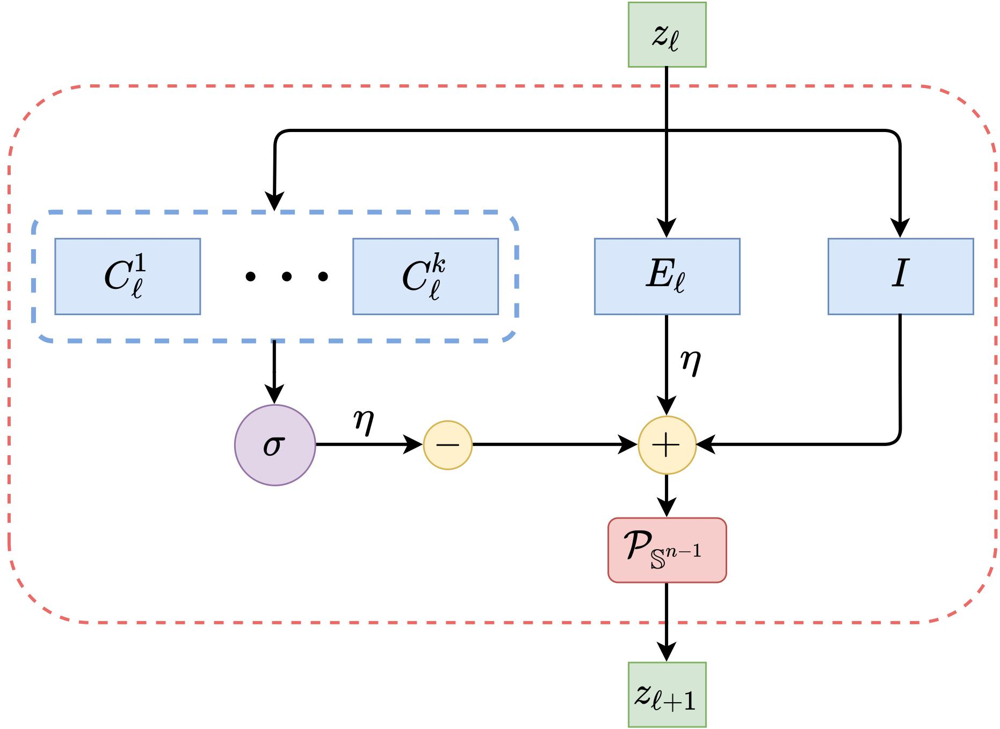

# Deep Networks from the Principle of Rate Reduction
This repository is the official implementation of the paper [Deep Networks from the Principle of Rate Reduction](https://arxiv.org/abs/2010.14765) (2020).

## What is ReduNet?
ReduNet is a deep neural network construcuted naturally by deriving the gradients of the Maximal Coding Rate Reduction (MCR<sup>2</sup>) [1] objective. Every layer of this network can be interpreted based on its mathematical operations and the network collectively is trained in a feed-forward manner only. In addition, by imposing shift invariant properties to our network, the convolutional operator can be derived using only the data and MCR<sup>2</sup> objective function, hence making our network design principled and interpretable. 

<p align="center">
    <br>
	Figure: Weights and operations for one layer of ReduNet
</p>
<p align="center">


[1] Yu, Yaodong, Kwan Ho Ryan Chan, Chong You, Chaobing Song, and Yi Ma. "[Learning diverse and discriminative representations via the principle of maximal coding rate reduction](https://proceedings.neurips.cc/paper/2020/file/6ad4174eba19ecb5fed17411a34ff5e6-Paper.pdf)" Advances in Neural Information Processing Systems 33 (2020). 

## Requirements
This codebase is written for `python3`. To install necessary python packages, run `pip install -r requirements.txt`.

## Training/Testing
### Training 
To train a model, one can run the training files, which has the dataset as thier names. For instance, to run a mixture of two Gaussians, one can run the command. 

```
$ python3 gaussian2d.py --data 1 --noise 0.1 --samples 500 --layers 500 --eps 0.1 --eta 0.1
```
All the files for training is listed below: 

- `gaussian2d.py`: mixture of Guassians in 2-dimensional Reals [code](https://github.com/ryanchankh/ReduNet/blob/69b59c57f367b9f3fdeda6ce68a7f414ebb438ce/dataset.py#L145)
- `gaussian3d.py`: mixture of Guassians in 3-dimensional Reals [code](https://github.com/ryanchankh/ReduNet/blob/69b59c57f367b9f3fdeda6ce68a7f414ebb438ce/dataset.py#L189)
- `iris.py`: Iris dataset from UCI Machine Learning Repository [link](http://archive.ics.uci.edu/ml/datasets/Iris/)
- `mice.py`: Mice Protein Expression Data Set [link](https://archive.ics.uci.edu/ml/datasets/Mice+Protein+Expression)
- `mnist.py`: MNIST dataset, each image is a flatten vector
- `mnist1d.py`: MNIST dataset, each image is multi-channel polar form and model is trained to have rotational invariance
- `mnist2d.py`: MNIST dataset, each image is single-channel and model is trained to have translational invariance
- `sinusoid.py`: mixture of sinusoidal waves, single and multichannel data

### Evaluating
To obtain the performance of the trained model, please use the file `evaluate.py`. And use commands such as:

```
$ python3 evaluate.py --model_dir ./saved_models/gaussian2d/data1_noise0.1/samples500_layers500_eps0.1_eta0.1
```

### Plotting
To obtain plots, such as loss and principle components, please use the file `plot.py`. And use commands such as: 

```
$ python3 plot.py --model_dir ./saved_models/gaussian2d/data1_noise0.1/samples500_layers500_eps0.1_eta0.1 --loss
```

## Reproducing Experimental Results
Please refer to our paper's Section 3 and Appendix D for experimental results and figures. Here are the commands to reproduce some of the experiments listed in the paper:

### For vector case experiments

For 2D and 3D Mixture of Gaussians (Figure 4 in paper):

```
$ python3 gaussian2d.py --data 1 --noise 0.1 --samples 500 --layers 2000 --eta 0.5 --eps 0.1
$ python3 gaussian3d.py --data 1 --noise 0.1 --samples 500 --layers 2000 --eta 0.5 --eps 0.1
```

For Iris and Mice Protein (Table 2 in paper):

```
$ python3 iris.py --layers 4000 --eta 0.1 --eps 0.1
$ python3 mice.py --layers 4000 --eta 0.1 --eps 0.1
```

For vector case MNIST:

```
$ python3 mnist.py --classes 0 1 --samples 500 --layers 2000 --eta 0.1 --eps 0.1
```

### For Shift-invariant experiments

For 1D signals (Sinusoids, Figure 5 (a)-(d) in paper):

```
$ python3 sinusoid.py --time 150 --samples 400 --channels 7 --layers 2000 --eps 0.1 --eta 0.1 --data 7 --kernel 3
```

For 1D signals (Rotational Invariant MNIST, Figure 5 (e)-(h) & Table 1 in paper):

```
$ python3 mnist1d.py --classes 0 1 --samples 2000 --time 200 --channels 5 --layers 3500 --eta 0.5 --eps 0.1
```

For 2D translational invariant MNIST data (Table 1 in paper):

```
$ python3 mnist2d.py --classes 0 1 --samples 500 --layers 2000 --eta 0.5 --eps 0.1
```

## Reference
For technical details and full experimental results, please check the [paper](https://arxiv.org/abs/2010.14765). Please consider citing our work if you find it helpful to yours:

```
@article{chan2020deep,
  title={Deep networks from the principle of rate reduction},
  author={Chan, Kwan Ho Ryan and Yu, Yaodong and You, Chong and Qi, Haozhi and Wright, John and Ma, Yi},
  journal={arXiv preprint arXiv:2010.14765},
  year={2020}
}
```

## License and Contributing
- This README is formatted based on [paperswithcode](https://github.com/paperswithcode/releasing-research-code).
- Feel free to post issues via Github. 

## Contact
Please contact [ryanchankh@berkeley.edu](ryanchankh@berkeley.edu) and [yyu@eecs.berkeley.edu](yyu@eecs.berkeley.edu) if you have any question on the codes.